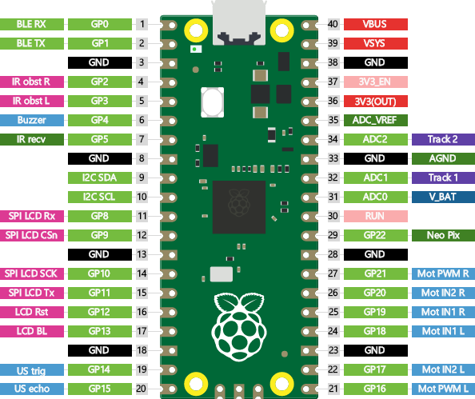
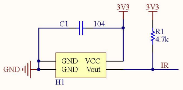
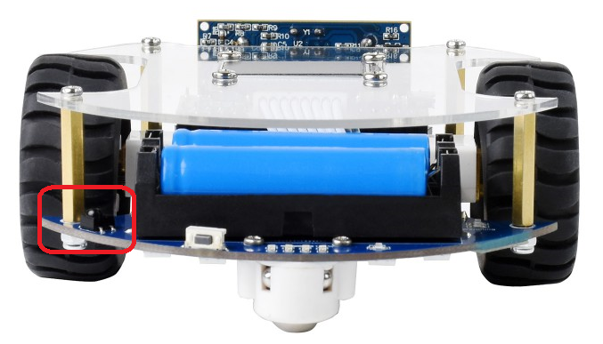
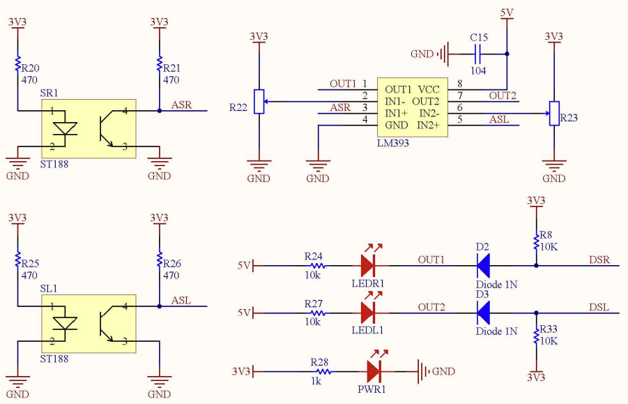
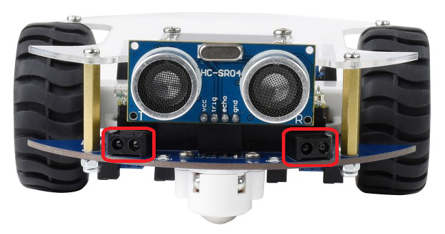
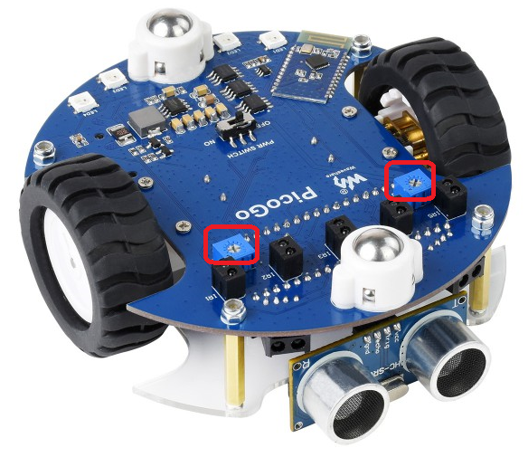
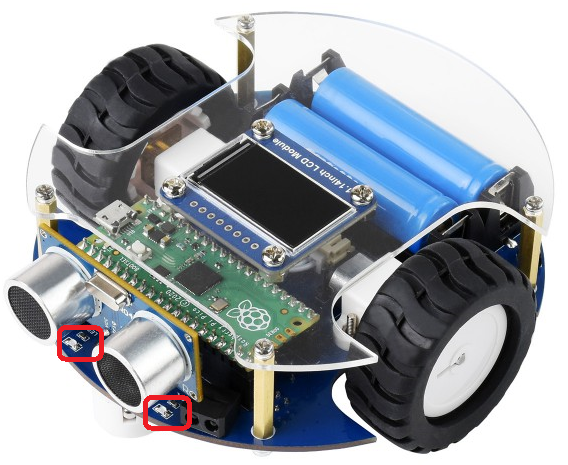
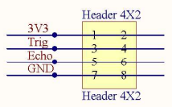
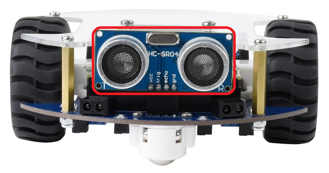

PicoGo Hardware
===============

+-----------------------------+----------+-----+-----+----------+-----------------+
| function                    | pin name | pin | pin | pin name | function        |
+=============================+==========+=====+=====+==========+=================+
| Bluetooth RX                | GPIO0    | 1   | 40  | VBUS     |                 |
+-----------------------------+----------+-----+-----+----------+-----------------+
| Bluetooth TX                | GPIO1    | 2   | 39  | VSYS     |                 |
+-----------------------------+----------+-----+-----+----------+-----------------+
|                             | GND      | 3   | 38  | GND      |                 |
+-----------------------------+----------+-----+-----+----------+-----------------+
| IR obstacle right           | GPIO2    | 4   | 37  | 3V3_EN   |                 |
+-----------------------------+----------+-----+-----+----------+-----------------+
| IR obstacle left            | GPIO3    | 5   | 36  | 3V3(OUT) |                 |
+-----------------------------+----------+-----+-----+----------+-----------------+
| Buzzer                      | GPIO4    | 6   | 35  | ADC_VREF |                 |
+-----------------------------+----------+-----+-----+----------+-----------------+
| IR receiver                 | GPIO5    | 7   | 34  | ADC2     | Tracking sensor |
+-----------------------------+----------+-----+-----+----------+-----------------+
|                             | GND      | 8   | 33  | GND      |                 |
+-----------------------------+----------+-----+-----+----------+-----------------+
| I2C SDA                     | GPIO6    | 9   | 32  | ADC1     | Tracking sensor |
+-----------------------------+----------+-----+-----+----------+-----------------+
| I2C SCL                     | GPIO7    | 10  | 31  | ADC0     | Battery voltage |
+-----------------------------+----------+-----+-----+----------+-----------------+
| LCD SPI RX                  | GPIO8    | 11  | 30  | RUN      |                 |
+-----------------------------+----------+-----+-----+----------+-----------------+
| LCD SPI CS                  | GPIO9    | 12  | 29  | GPIO22   | Neopixel        |
+-----------------------------+----------+-----+-----+----------+-----------------+
|                             | GND      | 13  | 28  | GND      |                 |
+-----------------------------+----------+-----+-----+----------+-----------------+
| LCD SPI SCK                 | GPIO10   | 14  | 27  | GPIO21   | Motor PWM right |
+-----------------------------+----------+-----+-----+----------+-----------------+
| LCD SPI TX                  | GPIO11   | 15  | 26  | GPIO20   | Motor IN2 right |
+-----------------------------+----------+-----+-----+----------+-----------------+
| LCD Reset                   | GPIO12   | 16  | 25  | GPIO19   | Motor IN1 right |
+-----------------------------+----------+-----+-----+----------+-----------------+
| LCD Backlight               | GPIO13   | 17  | 24  | GPIO18   | Motor IN1 left  |
+-----------------------------+----------+-----+-----+----------+-----------------+
|                             | GND      | 18  | 23  | GND      |                 |
+-----------------------------+----------+-----+-----+----------+-----------------+
| Ultrasonic distance trigger | GPIO14   | 19  | 22  | GPIO17   | Motor IN2 left  |
+-----------------------------+----------+-----+-----+----------+-----------------+
| Ultrasonic distance echo    | GPIO15   | 20  | 21  | GPIO16   | Motor PWM left  |
+-----------------------------+----------+-----+-----+----------+-----------------+

Infrared receiver
-----------------

The PicoGo robot features an IR receiver for remote controlling your robot.

From the schema and the actual hardware it is unclear what kind of component it is.
Based on search results, it could however be something like an Everlight IRM-H6XXT
or an Everlight EAIRMIA1. The top shows an engraving showing "AX14".

Infrared obstacle avoidance
---------------------------

The PicoGo robot reatures two reflective photointerrupters for detecting obstacles
in front of the robot.

Obstacles are detected using two Sunlight ST188 reflective photointerrupters. These
devices deliver a current that changes based on the distance to an obstacle. Using
a Texas Instruments LM393 differential comparator, this signal is converted into a
digital signal. This signal indicates whether an object was detected within a certain
threshold. Once the distance falls below this threshold, the value at the GPIOs 2
and 3, will change from ``1`` to ``0``. The threshold for this switch can be tuned using
the two potentiometers at the bottom of the robot. No software is needed for the
tuning process, as the robot also features two LEDs (marked LEDL and LEDR) that will
turn on as soon as the distance falls below the threshold.

Ultrasonic ranging
------------------

The PicoGo robot reatures an ultrasonic ranging module.

Ultrasonic ranging is done using an HC-SR04 module. This module has two interface
pins. The trigger pin - called `Trig` in the schema - can be set to ``1`` in order
to generate an ultrasonic pulse. According to the 
`Datasheet from Sparkfun <https://cdn.sparkfun.com/datasheets/Sensors/Proximity/HCSR04.pdf>`_
it is recommended to generate a trigger pulse of at least 10 μs. An ultrasonic
pulse is generated and reflected off of any obstacles. When there is an echo, the
`Echo` pin will provide a ``0``-``1``-``0``-pulse whose duration is proportional
to the distance to the obstacle.

Detailed theorie and tutorials for the HC-SR04 can be found on Adafruit_ and HowMechatronics_.

.. _Adafruit: https://www.adafruit.com/product/3942
.. _HowMechatronics: https://howtomechatronics.com/tutorials/arduino/ultrasonic-sensor-hc-sr04/

Display
-------

The display has a resolution of 240 x 135 pixel. Every pixel is represented by a 16-bit 5-6-5 RGB value